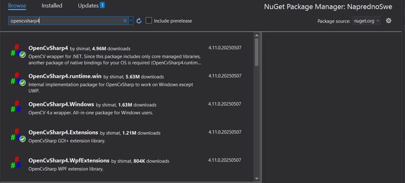

# Kreiranje aplikacije pomoću OpenCvSharp biblioteke
U ovom projektu razvijena je Windows Forms aplikacija koja koristi OpenCvSharp biblioteku. Cilj aplikacije je demonstracija i praktična primena odabranih funkcionalnosti ove biblioteke za obradu i analizu slika.

## Sadržaj

- [OpenCvSharp biblioteka](#opencvsharp-biblioteka)
  - [Mogućnosti biblioteke](#mogućnosti-biblioteke)
  - [Problem koji rešava](#problem-koji-rešava)
  - [Prednosti korišćenja](#prednosti-korišćenja)
  - [Konkurentna rešenja](#konkurentna-rešenja)
- [Instalacija biblioteke](#instalacija-biblioteke)
  - [Preduslovi](#preduslovi)
  - [Instalacija](#instalacija)
- [Implementacija](#implementacija)
- [Zaključak](#zaključak)

## OpenCvSharp biblioteka

OpenCvSharp predstavlja open-source .NET wrapper za popularnu biblioteku OpenCV, koja se koristi za obradu slika i računarski vid. Iako je OpenCV izvorno razvijena u programskom jeziku C++, OpenCvSharp omogućava korišćenje njenih funkcionalnosti direktno u .NET okruženju.

Zahvaljujući ovoj biblioteci, programeri mogu da razvijaju aplikacije u okviru tehnologija kao što su Windows Forms, WPF i .NET konzolne aplikacije, pri čemu se zadržava većina performansi koje pruža originalna C++ implementacija.

### Mogućnosti biblioteke
Biblioteka OpenCvSharp obuhvata većinu funkcionalnosti koje nudi originalna OpenCV biblioteka. Omogućava učitavanje i prikaz slika, kao i različite oblike obrade slika, uključujući filtriranje, zamućenje , konverziju između različitih modela boja  (grayscale, HSV, YCrCb...), kao i binarizaciju pomoću različitih metoda pragovanja. 

Jedne od značajnijih funkcionalnosti uključuju detekciju ivica i kontura, koje se koriste u različitim zadacima kao što su prepoznavanje objekata, segmentacija i detekcija oblika. 

Pored osnovnih metoda obrade, biblioteka pruža i naprednije tehnike koje se koriste u računarskom vidu. 

OpenCvSharp takođe ima i podršku za rad sa modelima dubokog učenja putem DNN (Deep Neutral Network) modula.
Pored rada sa statičkim slikama, biblioteka omogućava i rad sa video zapisima, uključujući prikaz video zapisa u realnom vremenu, njegovu obradu, kao i snimanje obrađenih video snimaka. Zahvaljujući ovim mogućnostima, OpenCvSharp se može koristiti za razvoj real-time aplikacija.

### Problem koji rešava 

Budući da je originalna OpenCV biblioteka napisana u programskom jeziku C++, njena direktna upotreba u C# projektima predstavlja određeni izazov. Zbog toga je razvijen OpenCvSharp, .NET wrapper koji omogućava korišćenje funkcionalnosti OpenCV biblioteke unutar .NET okruženja bez potrebe za napuštanjem poznatog jezika i razvojne platforme. 

Na taj način uklonjeno je ograničenje koje proizilazi iz razlike između programskih jezika, čime je eliminisana potreba za ručnim pisanjem interop sloja. To značajno pojednostavljuje razvoj aplikacija koje se bave obradom slike i računarskim vidom u C# jeziku.

### Prednosti korišćenja 

OpenCvSharp predstavlja jednostavno rešenje za integraciju OpenCV funkcionalnosti u .NET projekte, pružajući gotovo sve mogućnosti originalne OpenCV biblioteke.

Zahvaljujući optimizovanim native C++ funkcija, ova biblioteka omogućava visoke performanse, što je veoma značajno kod obrade slika i računarskog vida. 

Pored navedenih prednosti, treba napomenuti da OpenCvSharp ima aktivnu zajednicu korisnika i često ažuriran [GitHub repozitorijum](https://github.com/shimat/opencvsharp), kao i dobru [dokumentaciju](https://shimat.github.io/opencvsharp_docs/html/d69c29a1-7fb1-4f78-82e9-79be971c3d03.htm), što olakšava učenje i lakšu primenu biblioteke u različitim aplikacijama.


### Konkurentna rešenja 

OpenCvSharp nije jedina biblioteka koja omogućava korišćenje OpenCV funkcionalnosti unutar .NET aplikacija. Njena najpoznatija alternativa je Emgu CV, koja takođe predstavlja .NET wrapper za OpenCV biblioteku. 

Iako su obe biblioteke namenjene rešavanju sličnih problema, i imaju slične performanse, postoje i stvari po kojima se razlikuju i koje treba uzeti u obzir prilikom odabira jedne od njih.

Glavna razlika odnosi se na dodavanje biblioteke i jednostavnost korišćenja. OpenCvSharp je jednostavnija za dodavanje, jer se može instalirati direktno putem NuGet paketa, dok Emgu CV često zahteva ručno dodavanje native DLL-ova i dodatnih zavisnosti, čime se povećava kompleksnost i veličina projekta.

Još jedna od razlika je što Emgu CV koristi model dvostruke licence: open-source i komercijalna licenca. Ukoliko koristimo Emgu CV pod open-source uslovima, naš kod takođe mora da bude otvoren za zajednicu i njeno korišćenje i deljenje. U slučaju razvoja aplikacija zatvorenog koda, neophodna je kupovina komercijalne licence, što može predstavljati dodatni trošak.

Takođe, važno je napomenuti da je OpenCvSharp modernija i češće ažurirana biblioteka u poređenju sa Emgu CV, što je čini pogodnijom za projekte kojima je važnija savremena podrška i kompatibilnost sa novim verzijama OpenCV-ja.

## Instalacija biblioteke

### Preduslovi

Za instalaciju OpenCvSharp biblioteke preporučuje se korišćenje Visual Studio okruženja, koje ima ugrađene alate za upravljanje NuGet paketima, olakšavajući instalaciju i upravljanje zavisnostima u .NET projektima.

### Instalacija

Najjednostavniji način za instalaciju OpenCvSharp biblioteke u .NET projekat je korišćenjem NuGet paketa. Instalacija se može izvršiti na dva načina:
1. Kroz NuGet Package Manager Console
   
U Visual Studio-u otvorite Package Manager Console i unesite sledeću komandu:
```
Install-Package OpenCvSharp4
```
2. Kroz NuGet Package Manager UI

U Visual Studio-u kliknite desnim tasterom miša na projekat u Solution Explorer-u, izaberite Manage NuGet Packages. U okviru kartice Browse potražite paket OpenCvSharp4, izaberite ga i kliknite na Install. 

Pored osnovnog paketa OpenCvSharp4, u zavisnosti od platforme na kojoj razvijate aplikaciju, potrebno je instalirati i odgovarajuće dodatne pakete koji obezbeđuju potrebne native biblioteke i dodatne funkcionalnosti. 
- Za Windows platformu neophodno je uključiti paket OpenCvSharp4.runtime.win
- Za Linux platformu koristi se paket OpenCvSharp4.runtime.ubuntu.18.04-x64 (ili druga odgovarajuća verzija)

Još jedan od korisnih paketa je OpenCvSharp4.Extensions, koji pruža dodatne funkcije i alate koji olakšavaju rad sa OpenCvSharpom, kao što su konverzije između OpenCV objekata i standardnih .NET tipova, dodatne metode za manipulaciju slikama i integraciju sa drugim bibliotekama unutar .NET okruženja. 



U Visual Studio okruženju, u okviru panela References unutar projekta biće prikazani svi dodati NuGet paketi. Ovaj pregled nam omogućava da lako proverimo da li su svi neophodni paketi uspešno uključeni u projekat, što je ključno za pravilno funkcionisanje aplikacije i izbegavanje problema sa zavisnostima.

## Implementacija

U okviru ovog projekta razvijena je aplikacija Image Analyzer koja koristi OpenCvSharp biblioteku za obradu i analizu slika u .NET okruženju. Aplikacija omogućava korisniku da učita sliku sa računara, izvrši njenu obradu i nakon toga da sačuva izmenjenu sliku na računar. 

Glavne funkcionalnosti aplikacije uključuju: 
- Učitavanje i snimanje slike
  
Osnovni tip za predstavljanje slike u OpenCvSharp biblioteci je klasa Mat, čiji objekat sadrži informacije o slici, kao što su dimenzije, broj kanala i vrednosti pojedinačnih piksela.
Treba napomenuti da OpenCvSharp koristi unmanaged resurse za rad sa slikama i drugim objektima, što znači da memorija nije automatski upravljana kao u standardnom .NET okruženju. Zbog toga je neophodno ručno osloboditi zauzetu memoriju kada se objekti više ne koriste pozivanjem metode Dispose nad objektima kao što su Mat, Window i slično ili koristiti using blok koji omogućava automatsko oslobađanje memorije. Za rad sa slikama i video zapisima koristi se statička klasa Cv2, u kojoj su definisane sve potrebne metode.

Primer učitavanja slike pomoću metode `Cv2.ImRead()` u prethodno inicijalizovan Mat objekat. Da bismo sliku prikazali u PictureBox-u neophodno je izvršiti njenu konverziju iz Mat u Bitmap objekat.
```csharp 
private void openImageToolStripMenuItem1_Click(object sender, EventArgs e)
 {
            string combinedPath = Path.Combine(AppDomain.CurrentDomain.BaseDirectory, "..\\..\\Resources");
            openFileDialog.InitialDirectory = Path.GetFullPath(combinedPath);

            openFileDialog.Filter = "Photos (*.jpg;*.jpeg;*.png;*.bmp;*.gif;*.jfif;*.webp)|*.jpg;*.jpeg;*.png;*.bmp;*.gif;*.jfif;*.webp";
            if (openFileDialog.ShowDialog() == DialogResult.OK)
            {
				
                originalImage = Cv2.ImRead(openFileDialog.FileName);
		
                bitmapImage = OpenCvSharp.Extensions.BitmapConverter.ToBitmap(originalImage);
				
                pictureBoxOriginal.Image = bitmapImage;
                pictureBoxEdited.Image = bitmapImage;
            }
            else
            {
                MessageBox.Show("Unable to open an image!");
            }
}
```
Za snimanje slike koristi se metoda `Cv2.ImWrite`. Njoj se prosleđuje putanja na kojoj se čuva slika, kao i Mat objekat koji želimo da sačuvamo.

```csharp 
 private void saveImageToolStripMenuItem_Click(object sender, EventArgs e)
        {
            if (pictureBoxEdited.Image != null)
            {
                using (FolderBrowserDialog folderBrowserDialog = new FolderBrowserDialog())
                {
                    folderBrowserDialog.Description = "Select a location to save the image";

                    if (folderBrowserDialog.ShowDialog() == DialogResult.OK)
                    {
                        string folderPath = folderBrowserDialog.SelectedPath;
                        string imageName = Path.GetFileNameWithoutExtension(openFileDialog.FileName);
                        imageName += ".png";
                        string fullPath = Path.Combine(folderPath, imageName);

                        if (pictureBoxEdited.Image is Bitmap bitmap)
                        {
                            using (Mat mat = OpenCvSharp.Extensions.BitmapConverter.ToMat(bitmap))
                            {
                                Cv2.ImWrite(fullPath, mat);
                            }
                            MessageBox.Show("Image is saved!");
                        }
                    }
                    else
                        MessageBox.Show("No location selected for saving.");
                }
            }
            else
                MessageBox.Show("No image available for saving.");
        }
```


- Konverzija boja

Glavni model boja koji OpenCvSharp koristi za predstavljanje slika je BGR (Blue, Green, Red). Aplikacija omogućava konverziju slike iz BGR formata u Grayscale (nijanse sive boje) i HSV (Hue, Saturation, Value) format.

Metoda `Cv2.CvtColor` vrši konverziju boja iz jednog kolor prostora u drugi. Prva dva parametra predstavljaju ulaznu i izlaznu sliku, dok se kao treći parametar prosleđuje kod koji definiše pravac konverzije. U ovom slučaju, slika se konvertuje iz BGR u Grayscale korišćenjem koda `ColorConversionCodes.BGR2GRAY`.

```csharp 
 private Mat getGrayscale()
        {
            Mat gray = new Mat();
            Cv2.CvtColor(originalImage, gray, ColorConversionCodes.BGR2GRAY);
            return gray;
        }

```
Za konverziju iz BGR u HSV kao treći parametar potrebno je proslediti `ColorConversionCodes.BGR2HSV`.
```csharp 
Cv2.CvtColor(originalImage, editedImage, ColorConversionCodes.BGR2HSV);
```

- Zamućenje (Blur)

Za uklanjanje šuma sa slike koriste se različite vrste zamućenja. Neke od najčešće korišćenih tehnika su Gaussian Blur, Median Blur i Box Blur. Odgovarajuće metode za primenu ovih zamućenja su `CV2.GaussianBlur`, `CV2.MedianBlur` i `CV2.Blur`. Sve ove metode koriste parametar KernelSize, koji određuje dimenzije filtera (matrice) i direktno utiče na intenzitet zamućenja. Za Gaussian Blur pored veličine kernela koristi se i parametar sigma koji određuje standardnu devijaciju Gaussove funkcije

```csharp 
  switch (parameters.Type)
                {
                    case BlurType.Gaussian:
                        Cv2.GaussianBlur(originalImage, editedImage, new OpenCvSharp.Size(parameters.KernelSize, parameters.KernelSize), (double)parameters.Sigma);
                        break;
                    case BlurType.Median:
                        Cv2.MedianBlur(originalImage, editedImage, parameters.KernelSize);
                        break;
                    case BlurType.Box:
                        Cv2.Blur(originalImage, editedImage, new OpenCvSharp.Size(parameters.KernelSize, parameters.KernelSize));
                        break;
                }
```

- Binarizacija (Thresholding)

Za kreiranje binarne slike, odnosno slike koja se sastoji isključivo od crnih i belih piksela, koristi se tehnika thresholding. Ovim postupkom vrši se segmentacija slike na osnovu vrednosti praga, što omogućava odvajanje objekta od pozadine. U okviru projekta implementirane su različite threshold metode: Otsu Threshold, Adaptive Mean Threshold i Adaptive Gaussian Threshold. Kod adaptivnih metoda, korisnik može ručno podešavati parametre veličine kernela i konstantu C, čime se utiče na preciznost i kvalitet segmentacije.

Za primenu Otsu thresholda neophodno je metodi `Cv2.Threshold` proslediti parametar ThresholdTypes.Otsu. Ova tehnika automatski određuje optimalnu vrednost praga za segmentaciju slike, čime se postiže preciznija binarizacija bez potrebe za ručnim podešavanjem praga.

```csharp 
Cv2.Threshold(getGrayscale(), editedImage, 0, 255, ThresholdTypes.Binary | ThresholdTypes.Otsu);
```

Za primenu adaptivnih metoda binarizacije koristi se `Cv2.AdaptiveThreshold`. Kao parametar se prosleđuje tip adaptivnog praga, koji može biti `AdaptiveThresholdTypes.MeanC` ili `AdaptiveThresholdTypes.GaussianC`, u zavisnosti od željene metode izračunavanja vrednosti praga.

```csharp 
if (parameters.Type == AdaptiveType.Mean)
                Cv2.AdaptiveThreshold(grayImage, editedImage, 255, AdaptiveThresholdTypes.MeanC, ThresholdTypes.Binary, parameters.BlockSize, parameters.ConstantC);
            else
                Cv2.AdaptiveThreshold(grayImage, editedImage, 255, AdaptiveThresholdTypes.GaussianC, ThresholdTypes.Binary, parameters.BlockSize, parameters.ConstantC);
```

- Detekcija ivica (Edge detection)

Za određivanje granica kontura objekata na slici koriste se različite metode detekcija ivica. U okviru ovog projekta implementirane su tri poznate tehnike: Canny, Sobel i Laplacian detekcija ivica. 
Metode `CV2.Canny` i `CV2.Laplacian` primenjuju određene tehnike za detekciju ivica. Korisniku je omogućeno fino podešavanje parametara za što bolju detekciju. 
```csharp 
 if (parameters.Type == EdgeDetectionType.Canny)
                Cv2.Canny(getGrayscale(), editedImage, (double)parameters.Threshold1, (double)parameters.Threshold2, parameters.KernelSize);
            else
                Cv2.Laplacian(getGrayscale(), editedImage, MatType.CV_8U, parameters.KernelSize, (double)parameters.Scale, (double)parameters.Delta);
```

Za Sobel tehniku moguće je odabrati da li želimo detekciju horizontalnih, vertikalnih ili i jednih i drugih ivica. Metoda `Cv2.Sobel` omogućava pronalaženje ivica na osnovu promene intenziteta piksela u horizontalnom i vertikalnom pravcu. Prvi poziv sa parametrima (0,1) označava izvod po Y-osi, što detektuje vertikalne ivice, dok drugi poziv sa parametrima (1,0) označava izvod po X-osi, što detektuje horizontalne ivice.

```csharp 
Cv2.Sobel(getGrayscale(), sobelY, MatType.CV_8U, 0, 1);
Cv2.Sobel(getGrayscale(), sobelX, MatType.CV_8U, 1, 0);
```
Dobijene rezultate moguće je kombinovati pomoću metode `Cv2.AddWeighted`, koja omogućava linearnu kombinaciju dve slike. Na ovaj način, kombinuju se horizontalne i vertikalne ivice u jednu sliku.

```csharp 
Mat sobelX = sobelVertical();
Mat sobelY = sobelHorizontal();
Cv2.AddWeighted(sobelX, 0.5, sobelY, 0.5, 0, editedImage);

```

- Detekcija kontura

Nakon kreiranja binarne slike, moguće je izvršiti detekciju kontura. Prvo se kreira prazna slika istih dimenzija kao originalna, korišćenjem `Mat.Zeros`, na kojoj će konture biti iscrtane. Detekcija kontura vrši se pomoću metode `Cv2.FindContours`, kojoj se prosleđuje binarna slika, izlazni parametar `contours` koji će sadržati niz kontura pronađenih na slici, niz `hierarchy` koji sadrži informacije o hijerarhiji kontura, `RetrievalModes.Tree` koji omogućava očuvanje hijerarhije svih pronađenih kontura i `ContourApproximationModes.ApproxSimple` koji eliminiše suvišne tačke.

Nakon detekcije konture se iscrtavaju pomoću metode `Cv2.DrawContours`, kojoj se prosleđuju prethodno pronađene konture, boja kojom će one biti iscrtane, debljina linije, način povezivanja tačaka konture i hijerarhija. Pomoću metode `Cv2.ImShow` prikazuje se slika sa detektovanim konturama u posebnom prozoru.
```csharp 
private void findContoursToolStripMenuItem_Click(object sender, EventArgs e)
        {
            if (isImageAvailable())
            {
                Mat contourImage = Mat.Zeros(originalImage.Size(), MatType.CV_8UC3);
                Cv2.FindContours(editedImage, out OpenCvSharp.Point[][] contours, out HierarchyIndex[] hierarchy, RetrievalModes.Tree, ContourApproximationModes.ApproxSimple);
                Scalar color = new Scalar(255, 0, 0);
                for (int i = 0; i < contours.Length; i++)
                {
                    Cv2.DrawContours(contourImage, contours, i, color, 2, LineTypes.Link8, hierarchy, 0);
                }
                pictureBoxEdited.Image = OpenCvSharp.Extensions.BitmapConverter.ToBitmap(contourImage);
            }
        }
```

- Detekcija lica

Za detekciju lica korišćen je Haar Cascade klasifikator i prethodno trenirani model za frontalnu detekciju lica. Model se nalazi u xml fajlu `haarcascade_frontalface_default.xml` na zvaničnom [OpenCV GitHub repozitorijumu](https://github.com/opencv/opencv/blob/master/data/haarcascades/haarcascade_frontalface_default.xml). Neophodno je preuzetiovaj model i dodati ga u projekat unutar foldera Models. OpenCvSharp omogućava korišćenje ovog modela putem klase `CascadeClassifier`. Parametar modelPath predstavlja putanju do prethodno preuzetog modela, a metoda `DetectMultiScale()` služi za detektovanje više objekata na slici. Metodi se prosleđuje grayscale slika, faktor skaliranja i minimalni broj susednih pravougaonika koji moraju da prepoznaju isto lice da bi ono bilo potvrđeno kao validno. Pronađena lica smeštaju se u faces niz, nakon čega pomoću metode `Cv2.Rectangle` iscrtavamo crvene pravougaonike oko detektovanih lica.
```csharp 
private void faceDetectionToolStripMenuItem_Click(object sender, EventArgs e)
        {
            if (isImageAvailable())
            {
                editedImage = originalImage.Clone();
                string modelPath = Path.Combine(Application.StartupPath, "Models", "haarcascade_frontalface_default.xml");
                if (!File.Exists(modelPath))
                {
                    MessageBox.Show("Face detection model not found!");
                    return;
                }

                var faceCascade = new CascadeClassifier(modelPath);

                Rect[] faces = faceCascade.DetectMultiScale(getGrayscale(), 1.1, 5);

                if (faces.Length == 0)
                {
                    MessageBox.Show("No faces were detected in the image.");
                    return;
                }


                foreach (var face in faces)
                {
                    Cv2.Rectangle(editedImage, face, Scalar.Red, 2);
                }

                setEditedImage();
            }
        }
```


## Zaključak

OpenCvSharp predstavlja efikasno rešenje za programere koji žele da iskoriste mogućnosti OpenCV biblioteke unutar .NET okruženja, bez potrebe za učenjem drugih programskih jezika.

Ova biblioteka je laka za korišćenje i omogućava brz razvoj aplikacija zahvaljujući jednostavnom API-ju i dobroj integraciji sa .NET okruženjem.

Međutim, u slučajevima gde su ključne maksimalne performanse i brzina izvršavanja, preporučuje se korišćenje originalne verzije OpenCV biblioteke napisane u C++ jeziku.


